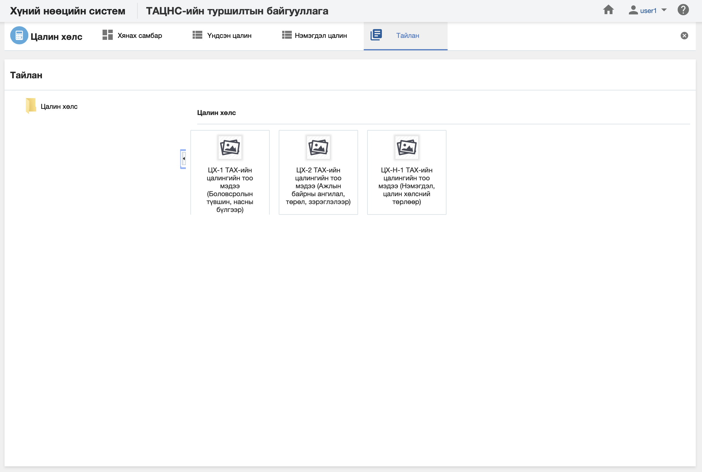

<h1 align="center">Цалин хөлс модулийн тайлан</h1>

Албан байгууллагын цалин хөлсний мэдээлэлд шинжилгээ хийж дата шинжилгээний үр дүнг урьдчилан бэлтгэсэн тайлангуудын загвараар гаргана.

> Тайлантай хэрхэн ажиллах талаар ерөнхий ойлголтыг [тайлантай ажиллах](how-it-works?id=_5-Тайлантай-ажиллах) хэсгээс харна уу.

Цалин, хөлс дээр дараах тайлангуудыг урьдчилан тодорхойлсон байна.

**Үүнд:**

- **ЦХ-1 ТАХ-ийн цалин хөлсний тоо мэдээ (Боловсролын түвшин, насны бүлгээр, байгууллагаар)**
   Байгууллагын цалин хөлсний тоог тайлангийн үзүүлэлтээр гаргах тайлан (Боловсролын түвшин, насны бүлгээр, байгууллагаар)  
- **ЦХ-2 Цалин хөлсний тоо мэдээ (Ажлын байрны ангилал, төрөл, зэрэглэлээр, байгууллагаар)**
   Байгууллагын цалин хөлсний тоог тайлангийн үзүүлэлтээр гаргах тайлан (Ажлын байрны ангилал, төрөл, зэрэглэлээр, байгууллагаар)  
- **ЦХ-Н-1 ТАХ-ийн цалин хөлсний тоо мэдээ (Нэмэгдэл цалин, хөлсний төрлөөр, байгууллагаар)**
   Байгууллагын цалин хөлсний тоог тайлангийн үзүүлэлтээр гаргах тайлан (Нэмэгдэл цалин, хөлсний төрлөөр, байгууллагаар)  
