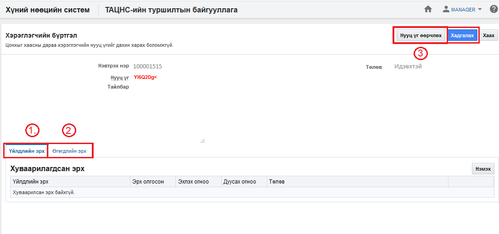

<h1 align="center">Системийн тохиргоо</h1>

Байгууллагын админ өөрийн байгууллагын төрийн албаны хүний нөөцийн нэгдсэн системд ажиллах хэрэглэгчийн эрх үүсгэх үйл ажиллагааг зохион байгуулна. Энэхүү тохиргоонд төрийн албаны хүний нөөцийн нэгдсэн системд хийх үйлдэл болон өгөгдлийн эрхийг тохируулж өгөхөөс гадна шинээр нууц үгийг үүсгэх үйлдлийг хийнэ.

### Хэрэглэгч удирдах

**Хэрэглэгч удирдах** үйлдэл нь хэрэглэгчийн эрх, үүргийг системд үүсгэх боломжийг бүрдүүлнэ. Хэрэглэгчийн үйлдлийн болон өгөгдлийн эрхийг тохируулж өгнө. Мөн шинээр нууц үг үүсгэх боломжтой.

> Дээрх зурганд хэрэглэгч удирдах бүртгэлийн мэдээллийг харуулж байна.

#### Хэрэглэгчийн бүртгэл:
Нэвтрэх нэр, нууц үгийг системээс харуулна. 

- **1. Үйлдлийн эрх**
     Үйлдлийн эрх. Хэрэглэгчийн үйлдэл хийх эрхийг тохируулах хэсэг  
- **2. Өгөгдлийн эрх**
     Өгөгдлийн эрх. Хэрэглэгчийн өгөгдлийн эрхийг тохируулах хэсэг  
- **3. Нууц үг өөрчлөх**
     Нууц үг өөрчлөх. Хэрэглэгчийн нууц үгийг үүсгэх хэсэг  

#### Үйлдлийн нөлөөлөл
  Энэхүү үйлдлийг хийх үед бусад мэдээлэлд хэрхэн нөлөөлөх нөлөөллийг заана. Үүнд:
  - Систем дээр ямар нэгэн нөлөөлөл байхгүй байна

