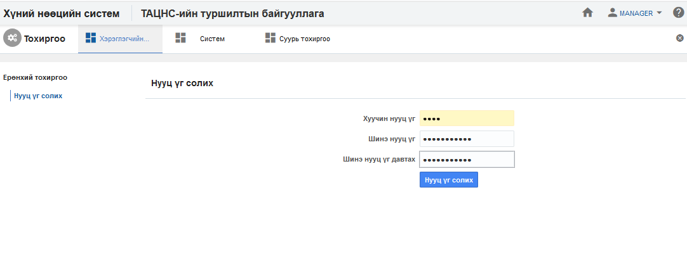

<h1 align="center">Хэрэглэгчийн тохиргоо</h1>

Төрийн албаны хүний нөөцийн нэгдсэн системийн хэрэглэгч өөрийн системд нэвтрэх нууц үгээ солих үйл ажиллагааг зохион байгуулна.
### Нууц үг солих

**Нууц үг солих** үйлдэл нь хэрэглэгчийн эрхийн нууц үгийг өөрчлөх боломжийг бүрдүүлнэ.

Дээрх зурагт харуулсан талбаруудын мэдээллийг оруулж **нууц үг солих** товчийг дарснаар үйлдэл хийгдэнэ.

#### Үйлдлийн нөлөөлөл
  Энэхүү үйлдлийг хийх үед бусад мэдээлэлд хэрхэн нөлөөлөх нөлөөллийг заана. Үүнд:
  - Систем дээр ямар нэгэн нөлөөлөл үзүүлэхгүй.