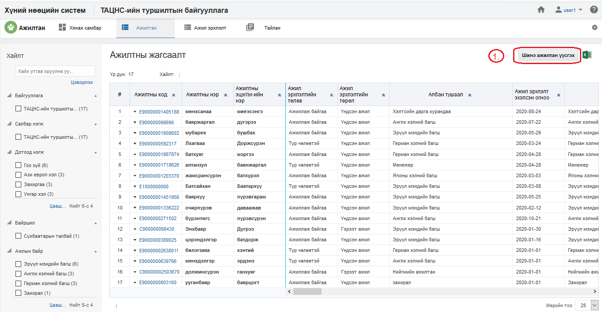
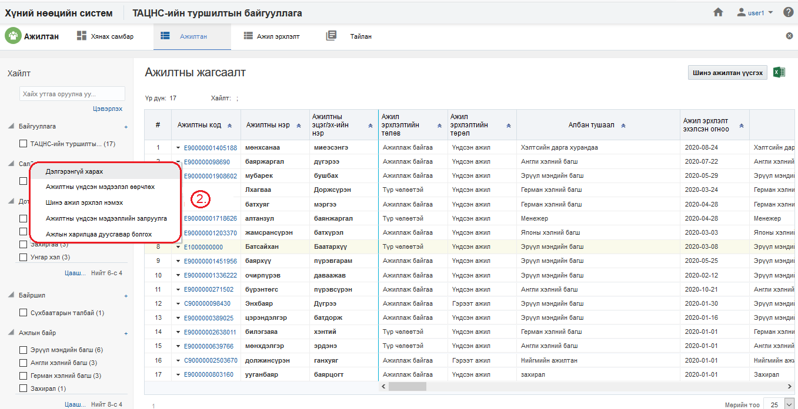
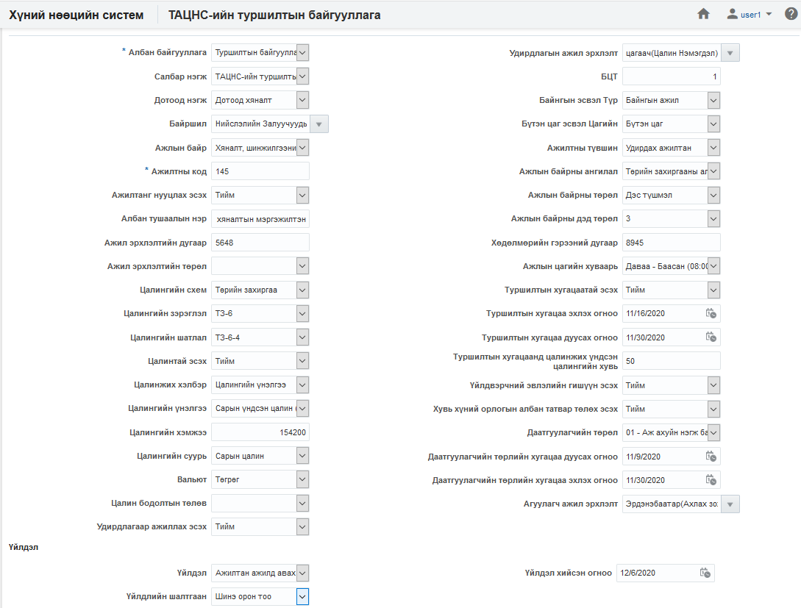
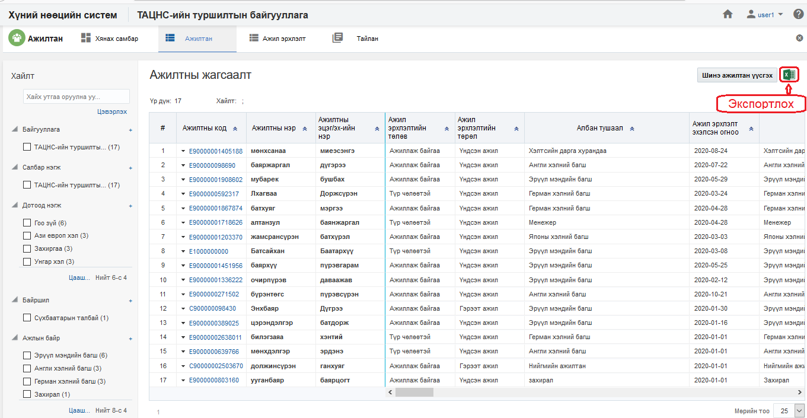
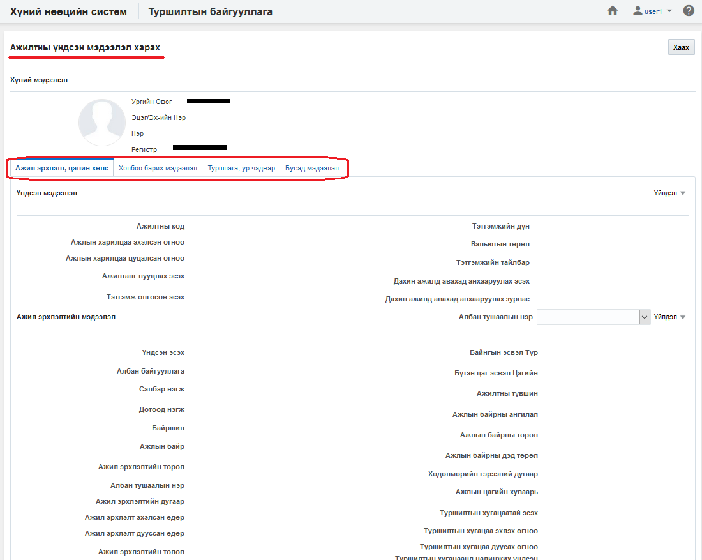
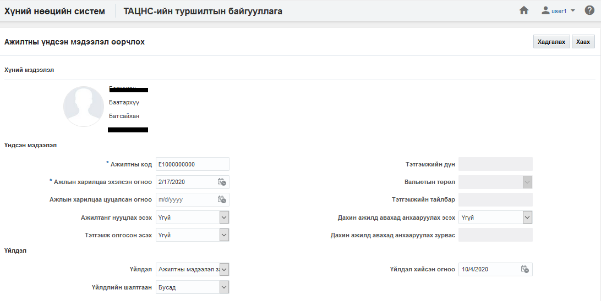
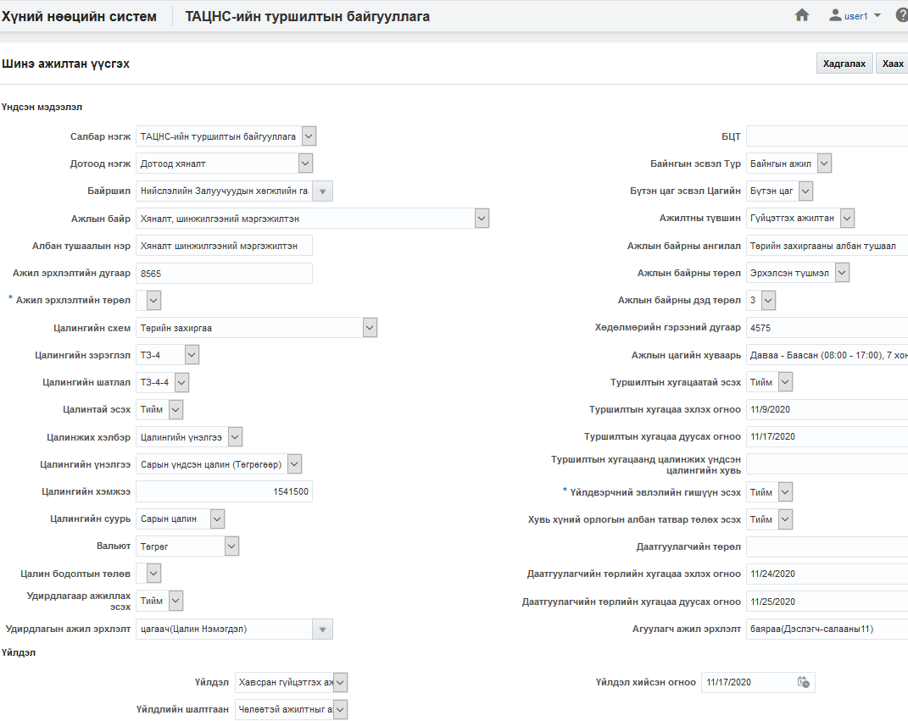
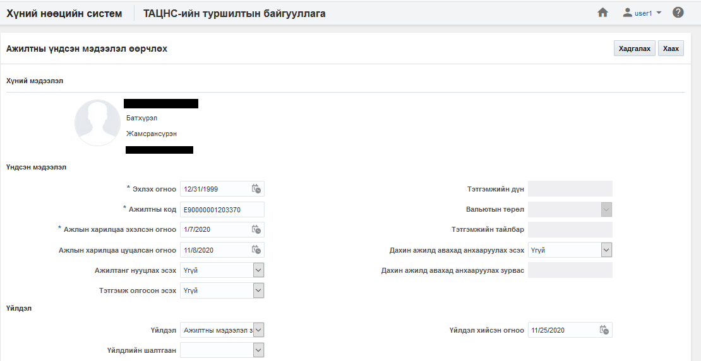
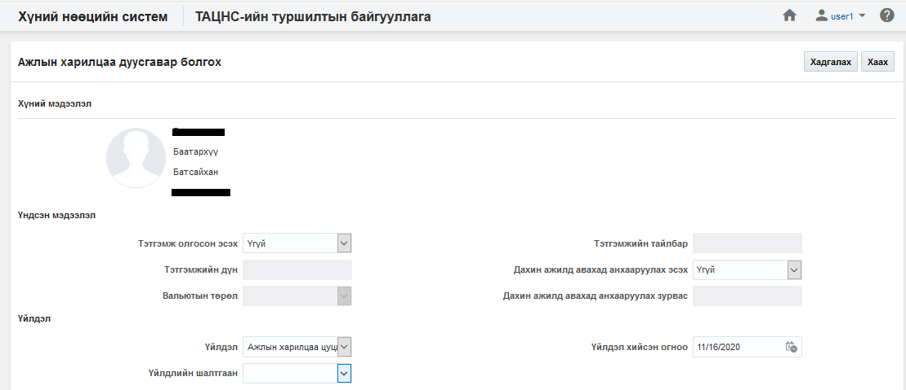

<h1 align="center">Ажилтан, ажил эрхлэлтийн үйлдэл</h1>

Ажилтан, ажил эрхлэлтийн мэдээллийн өөрчлөлт, залруулах, ажлын харилцаа дуусгавар болгох, үндсэн ажил эрхлэлт болгох, ажил эрхлэлтийг чөлөөтэй болгох, түр түдгэлзүүлэх, шилжүүлэх, идэвхгүй болгох ... зэрэг үйлдлүүдийг хэрэглэгчид зөвшөөрөгдсөн эрхийн дагуу хийж болно.

## Үйлдэл хийх арга зам
Үйлдлийг хийхдээ жагсаалт цонхноос 2 төрлийн арга замаар хийнэ.

- ### 1. Ерөнхий цэс

  Жагсаалтын цонхны баруун дээд буланд байршина.

  

- ### 2. Контекст цэс

  Жагсаалтын цонхны үр дүн харуулах хэсэгт мөр дэх жижиг сум хэлбэртэй цэсийг контекст цэс гэнэ.

  

## Ажилтан, ажил эрхлэлтийн үйлдлүүд
Ажилтан модуль дээр дараах үйлдлүүдийг хийж болно.

**Үүнд:**

- [Шинэ ажилтан үүсгэх](Workers/action.md?id=Шинэ-ажилтан-үүсгэх)
- [Жагсаалт экспортлох](Workers/action.md?id=Жагсаалт-экспортлох)
- [Ажилтны профайль](Workers/action.md?id=Ажилтны-профайль)
- [Ажилтны үндсэн мэдээлэл өөрчлөх](Workers/action.md?id=Ажилтны-үндсэн-мэдээлэл-өөрчлөх)
- [Шинэ ажил эрхлэлт нэмэх](Workers/action.md?id=Шинэ-ажил-эрхлэлт-нэмэх)
- [Ажилтны үндсэн мэдээллийн залруулга](Workers/action.md?id=Ажилтны-үндсэн-мэдээллийн-залруулга)
- [Ажлын харилцаа дуусгавар болгох](Workers/action.md?id=Ажлын-харилцаа-дуусгавар-болгох)
- [Ажил эрхлэлт өөрчлөх](Workers/action.md?id=Ажил-эрхлэлт-өөрчлөх)
- [Ажил эрхлэлт залруулах](Workers/action.md?id=Ажил-эрхлэлт-залруулах)
- [Үндсэн ажил эрхлэлт болгох](Workers/action.md?id=Үндсэн-ажил-эрхлэлт-болгох)
- [Ажил эрхлэлтийг чөлөөтэй болгох](Workers/action.md?id=Ажил-эрхлэлтийг-чөлөөтэй-болгох)
- [Ажил эрхлэлт түр түдгэлзүүлэх](Workers/action.md?id=Ажил-эрхлэлт-түр-түдгэлзүүлэх)
- [Ажил эрхлэлт идэвхтэй болгох](Workers/action.md?id=Ажил-эрхлэлт-идэвхтэй-болгох)
- [Ажил эрхлэлт дуусгавар болгох](Workers/action.md?id=Ажил-эрхлэлт-дуусгавар-болгох)
- [Ажил эрхлэлт шилжүүлэх](Workers/action.md?id=Ажил-эрхлэлт-шилжүүлэх)
- [Үндсэн цалин нэмэх](Workers/action.md?id=Үндсэн-цалин-нэмэх)
- [Ажилтны нэмэгдэл цалин хөлс нэмэх](Workers/action.md?id=Ажилтны-нэмэгдэл-цалин-хөлс-нэмэх)

### Шинэ ажилтан үүсгэх

**Шинэ ажилтан үүсгэх** үйлдэл нь байгууллагад шинэ ажилтан мэдээллийн санд нэмэх үйлдэл юм.

#### Үйлдлийн өмнөх нөхцөл
  Энэхүү үйлдлийг хийхээс өмнө ямар нөхцөл бүрдсэн байхыг энэ хэсэгт жагсаалтаар зааж байна. Үүнд:
  - Ажилтны ажил эрхлэлт үүсгэх албан байгууллага, салбар нэгж, дотоод нэгж системд үүссэн байх
  - Ажилтны ажил эрхлэлт үүсгэх ажлын байр, орон тоо системд үүссэн байх

#### Үйлдлийн нөлөөлөл
  Энэхүү үйлдлийг хийх үед бусад мэдээлэлд хэрхэн нөлөөлөх нөлөөллийг заана. Үүнд:
  - Ажилтан, ажил эрхлэлтийн хянах самбарын график тоон мэдээлэл өөрчлөгдөнө.
  - Ажилтан, ажил эрхлэлтийн жагсаалтад шинэ бичлэг нэмэгдэнэ.
  - Ажилтан, ажил эрхлэлтийн тайлангийн тоон мэдээлэл өөрчлөгдөнө.

### Жагсаалт экспортлох

**Жагсаалт экспортлох** үйлдэл нь хайлт шүүлтийн үр дүнг майкрософт эксел файлаар экспортлон авах үйлдэл юм.

#### Үйлдлийн өмнөх нөхцөл
  Энэхүү үйлдлийг хийхээс өмнө ямар нөхцөл бүрдсэн байхыг энэ хэсэгт жагсаалтаар зааж байна. Үүнд:
  - Экспортлох мэдээллээ зөв шүүсэн эсэхээ шалгах

#### Үйлдлийн нөлөөлөл
  Энэхүү үйлдлийг хийх үед бусад мэдээлэлд хэрхэн нөлөөлөх нөлөөллийг заана. Үүнд:
  - Систем дээр ямар нэгэн нөлөөлөл байхгүй байна

### Ажилтны профайль

**Ажилтны профайль** үйлдэл нь тухайн сонгосон ажилтны мэдээллийг нэг цонхноос авах боломжийг бүрдүүлнэ.

#### Үйлдлийн өмнөх нөхцөл
  Энэхүү үйлдлийг хийхээс өмнө ямар нөхцөл бүрдсэн байхыг энэ хэсэгт жагсаалтаар зааж байна. Үүнд:
  - Зөв ажилтан сонгосон эсэхээ шалгах

#### Үйлдлийн нөлөөлөл
  Энэхүү үйлдлийг хийх үед бусад мэдээлэлд хэрхэн нөлөөлөх нөлөөллийг заана. Үүнд:
  - Систем дээр ямар нэгэн нөлөөлөл байхгүй байна

### Ажилтны үндсэн мэдээлэл өөрчлөх

**Ажилтны үндсэн мэдээлэл өөрчлөх** үйлдэл нь тухайн сонгосон ажилтны үндсэн мэдээллийг өөрчлөх боломжийг бүрдүүлнэ.Өөрчлөх үйлдэл нь өөрчлөлтийн түүхийг бүрдүүлнэ.

#### Үйлдлийн өмнөх нөхцөл
  Энэхүү үйлдлийг хийхээс өмнө ямар нөхцөл бүрдсэн байхыг энэ хэсэгт жагсаалтаар зааж байна. Үүнд:
  - Зөв ажилтан сонгосон эсэхээ шалгах

#### Үйлдлийн нөлөөлөл
  Энэхүү үйлдлийг хийх үед бусад мэдээлэлд хэрхэн нөлөөлөх нөлөөллийг заана. Үүнд:
  - Ажилтан, ажил эрхлэлтийн хянах самбарын график тоон мэдээлэл өөрчлөгдөнө.
  - Ажилтан, ажил эрхлэлтийн жагсаалтын мэдээлэл өөрчлөгдөнө.
  - Ажилтан, ажил эрхлэлтийн тайлангийн тоон мэдээлэл өөрчлөгдөнө.

### Шинэ ажил эрхлэлт нэмэх

**Шинэ ажил эрхлэлт нэмэх** үйлдэл нь байгууллагад ажилтны шинэ ажил эрхлэлтийг мэдээллийн санд нэмэх үйлдэл юм. Нэг ажилтанд хэд хэдэн ажил эрхлэлт үүсч болно.

#### Үйлдлийн өмнөх нөхцөл
  Энэхүү үйлдлийг хийхээс өмнө ямар нөхцөл бүрдсэн байхыг энэ хэсэгт жагсаалтаар зааж байна. Үүнд:
  - Ажилтны ажил эрхлэлт үүсгэх албан байгууллага, салбар нэгж, дотоод нэгж системд үүссэн байх
  - Ажилтны ажил эрхлэлт үүсгэх ажлын байр, орон тоо системд үүссэн байх

#### Үйлдлийн нөлөөлөл
  Энэхүү үйлдлийг хийх үед бусад мэдээлэлд хэрхэн нөлөөлөх нөлөөллийг заана. Үүнд:
  - Ажилтан, ажил эрхлэлтийн хянах самбарын график тоон мэдээлэл өөрчлөгдөнө.
  - Ажилтан, ажил эрхлэлтийн жагсаалтын мэдээлэл өөрчлөгдөнө.
  - Ажилтан, ажил эрхлэлтийн тайлангийн тоон мэдээлэл өөрчлөгдөнө.

### Ажилтны үндсэн мэдээллийн залруулга

**Ажилтны үндсэн мэдээллийн залруулга** үйлдэл нь тухайн сонгосон ажилтны үндсэн мэдээллийг залруулга хийх боломжийг бүрдүүлнэ. Энэ нь өмнө оруулсан мэдээллийг дарж залруулга хийж байгаа үйлдэл юм.

#### Үйлдлийн өмнөх нөхцөл
  Энэхүү үйлдлийг хийхээс өмнө ямар нөхцөл бүрдсэн байхыг энэ хэсэгт жагсаалтаар зааж байна. Үүнд:
  - Зөв ажилтан сонгосон эсэхээ шалгах

#### Үйлдлийн нөлөөлөл
  Энэхүү үйлдлийг хийх үед бусад мэдээлэлд хэрхэн нөлөөлөх нөлөөллийг заана. Үүнд:
  - Ажилтан, ажил эрхлэлтийн хянах самбарын график тоон мэдээлэл өөрчлөгдөнө.
  - Ажилтан, ажил эрхлэлтийн жагсаалтын мэдээлэл өөрчлөгдөнө.
  - Ажилтан, ажил эрхлэлтийн тайлангийн тоон мэдээлэл өөрчлөгдөнө.

### Ажлын харилцаа дуусгавар болгох

**Ажлын харилцаа дуусгавар болгох** үйлдэл нь тухайн сонгосон ажилтны ажлын харилцааг цуцлах үйлдэл юм. 

#### Үйлдлийн өмнөх нөхцөл
  Энэхүү үйлдлийг хийхээс өмнө ямар нөхцөл бүрдсэн байхыг энэ хэсэгт жагсаалтаар зааж байна. Үүнд:
  - Зөв ажилтан сонгосон эсэхийг шалгах
  - Сонгосон ажилтны ажил эрхлэлтийн төлөв нь идэвхтэй, чөлөөтэй төлөвтэй үед хийх боломжтой 
 

#### Үйлдлийн нөлөөлөл
  Энэхүү үйлдлийг хийх үед бусад мэдээлэлд хэрхэн нөлөөлөх нөлөөллийг заана. Үүнд:
  - Ажилтан, ажил эрхлэлтийн хянах самбарын график тоон мэдээлэл өөрчлөгдөнө.
  - Ажилтан, ажил эрхлэлтийн жагсаалтын мэдээлэл өөрчлөгдөнө.
  - Ажилтан, ажил эрхлэлтийн тайлангийн тоон мэдээлэл өөрчлөгдөнө.
 

### Ажил эрхлэлт өөрчлөх

**Ажил эрхлэлт өөрчлөх** үйлдэл нь тухайн сонгосон ажилтны ажил эрхлэлтийн мэдээллийг засах боломжийг бүрдүүлнэ. Өөрчлөх үйлдэл нь өөрчлөлтийн түүхийг бүрдүүлнэ.

#### Үйлдлийн өмнөх нөхцөл
  Энэхүү үйлдлийг хийхээс өмнө ямар нөхцөл бүрдсэн байхыг энэ хэсэгт жагсаалтаар зааж байна. Үүнд:
  - Зөв ажилтан сонгосон эсэхээ шалгах

#### Үйлдлийн нөлөөлөл
  Энэхүү үйлдлийг хийх үед бусад мэдээлэлд хэрхэн нөлөөлөх нөлөөллийг заана. Үүнд:
  - Ажилтан, ажил эрхлэлтийн хянах самбарын график тоон мэдээлэл өөрчлөгдөнө.
  - Ажилтан, ажил эрхлэлтийн жагсаалтын мэдээлэл өөрчлөгдөнө.
  - Ажилтан, ажил эрхлэлтийн тайлангийн тоон мэдээлэл өөрчлөгдөнө.

### Ажил эрхлэлт залруулга

**Ажил эрхлэлт залруулга** үйлдэл нь тухайн сонгосон ажилтны ажил эрхлэлтийн мэдээллийг залруулга хийх боломжийг бүрдүүлнэ. Энэ нь өмнө оруулсан ажил эрхлэлтийн мэдээллийг дарж залруулга хийж байгаа үйлдэл юм.

#### Үйлдлийн өмнөх нөхцөл
  Энэхүү үйлдлийг хийхээс өмнө ямар нөхцөл бүрдсэн байхыг энэ хэсэгт жагсаалтаар зааж байна. Үүнд:
  - Зөв ажилтны, зөв ажил эрхлэлтийг сонгосон эсэхээ шалгах

#### Үйлдлийн нөлөөлөл
  Энэхүү үйлдлийг хийх үед бусад мэдээлэлд хэрхэн нөлөөлөх нөлөөллийг заана. Үүнд:
  - Ажилтан, ажил эрхлэлтийн хянах самбарын график тоон мэдээлэл өөрчлөгдөнө.
  - Ажилтан, ажил эрхлэлтийн жагсаалтын мэдээлэл өөрчлөгдөнө.
  - Ажилтан, ажил эрхлэлтийн тайлангийн тоон мэдээлэл өөрчлөгдөнө.

### Үндсэн ажил эрхлэлт болгох

**Үндсэн ажил эрхлэлт болгох** үйлдэл нь сонгосон ажилтны ажил эрхлэлтээс үндсэн биш ажил эрхлэлтийг үндсэн ажил эрхлэлт болгох үйлдэл юм. Энэ үйлдэл нь тухайн ажилтан дээр олон ажил эрхлэлт байх үед ашиглагдах бөгөөд зөвхөн **үндсэн ажил эрхлэлт биш** ажил эрхлэлт дээр хийгдэх боломжтой.

#### Үйлдлийн өмнөх нөхцөл
  Энэхүү үйлдлийг хийхээс өмнө ямар нөхцөл бүрдсэн байхыг энэ хэсэгт жагсаалтаар зааж байна. Үүнд:
  - Зөв ажилтан, ажил эрхлэлтийг сонгосон эсэхээ шалгах

#### Үйлдлийн нөлөөлөл
  Энэхүү үйлдлийг хийх үед бусад мэдээлэлд хэрхэн нөлөөлөх нөлөөллийг заана. Үүнд:
  - Ажилтан, ажил эрхлэлтийн хянах самбарын график тоон мэдээлэл өөрчлөгдөнө.
  - Ажилтан, ажил эрхлэлтийн жагсаалтын мэдээлэл өөрчлөгдөнө.
  - Ажилтан, ажил эрхлэлтийн тайлангийн тоон мэдээлэл өөрчлөгдөнө.

### Ажил эрхлэлтийг түр чөлөөлөх

**Ажил эрхлэлтийг түр чөлөөлөх** үйлдэл нь тухайн сонгосон ажилтны ажил эрхлэлтийг түр чөлөөлөх боломжийг бүрдүүлнэ. Түр чөлөөлөх үйлдэл нь өөрчлөлтийн түүхийг бүрдүүлнэ.

#### Үйлдлийн өмнөх нөхцөл
  Энэхүү үйлдлийг хийхээс өмнө ямар нөхцөл бүрдсэн байхыг энэ хэсэгт жагсаалтаар зааж байна. Үүнд:
  - Зөв ажилтан, зөв ажил эрхлэлтийг сонгосон эсэхээ шалгах

#### Үйлдлийн нөлөөлөл
  Энэхүү үйлдлийг хийх үед бусад мэдээлэлд хэрхэн нөлөөлөх нөлөөллийг заана. Үүнд:
  - Ажилтан, ажил эрхлэлтийн хянах самбарын график тоон мэдээлэл өөрчлөгдөнө.
  - Ажилтан, ажил эрхлэлтийн жагсаалтын мэдээлэл өөрчлөгдөнө.
  - Ажилтан, ажил эрхлэлтийн тайлангийн тоон мэдээлэл өөрчлөгдөнө.
  - Ажил эрхлэлтийн өөрчлөх үйлдлүүд хийх боломжгүй болно.
  - Цалин хөлсний өөрчлөх үйлдлүүд хийх боломжгүй болно.

### Ажил эрхлэлт түр түдгэлзүүлэх

**Ажил эрхлэлт түр түдгэлзүүлэх** үйлдэл нь тухайн сонгосон ажилтны ажил эрхлэлтийн төлөвийг түр түдгэлзүүлсэн төлөвт шилжүүлэх бөгөөд хэрэв ажилтны ажил эрхлэлт нь түр түдгэлзүүлсэн төлөвт шилжсэн бол тухайн ажилтны ажил эрхлэлт дээр ямар нэгэн үйлдэл хийх боломж түр хаагдана. Энэ үйлдлийг зөвхөн **идэвхтэй төлөвтэй ажил эрхлэлт** дээр хийх боломжтой.

#### Үйлдлийн өмнөх нөхцөл
  Энэхүү үйлдлийг хийхээс өмнө ямар нөхцөл бүрдсэн байхыг энэ хэсэгт жагсаалтаар зааж байна. Үүнд:
  - Зөв ажилтан, зөв ажил эрхлэлтийг сонгосон эсэхээ шалгах
  - Сонгосон ажил эрхлэлтийн төлөв нь идэвхтэй эсэхийг шалгах

#### Үйлдлийн нөлөөлөл
  Энэхүү үйлдлийг хийх үед бусад мэдээлэлд хэрхэн нөлөөлөх нөлөөллийг заана. Үүнд:
  - Ажилтан, ажил эрхлэлтийн хянах самбарын график тоон мэдээлэл өөрчлөгдөнө.
  - Ажилтан, ажил эрхлэлтийн жагсаалтын мэдээлэл өөрчлөгдөнө
  - Ажилтан, ажил эрхлэлтийн тайлангийн тоон мэдээлэл өөрчлөгдөнө.
  - Ажилтан, ажил эрхлэлтийн өөрчлөх үйлдлүүд хийх боломжгүй болно.
  - Цалин хөлсний өөрчлөх үйлдлүүд хийх боломжгүй болно.

### Ажил эрхлэлт идэвхтэй болгох

**Ажил эрхлэлт идэвхтэй болгох** үйлдэл нь тухайн сонгосон ажилтны ажил эрхлэлтийн төлөвийг идэвхтэй төлөвт шилжүүлэх үйлдэл юм. Энэ үйлдэл нь зөвхөн ажилтны **идэвхгүй** ажил эрхлэлт дээр хийгдэх боломжтой.

#### Үйлдлийн өмнөх нөхцөл
  Энэхүү үйлдлийг хийхээс өмнө ямар нөхцөл бүрдсэн байхыг энэ хэсэгт жагсаалтаар зааж байна. Үүнд:
  - Зөв ажилтан, зөв ажил эрхлэлт сонгосон эсэхээ шалгах
  - Сонгосон ажилтны ажил эрхлэлтийн төлөв идэвхгүй эсэхийг шалгах

#### Үйлдлийн нөлөөлөл
  Энэхүү үйлдлийг хийх үед бусад мэдээлэлд хэрхэн нөлөөлөх нөлөөллийг заана. Үүнд:
  - Ажилтан, ажил эрхлэлтийн хянах самбарын график тоон мэдээлэл өөрчлөгдөнө.
  - Ажилтан, ажил эрхлэлтийн жагсаалтын мэдээлэл өөрчлөгдөнө.
  - Ажилтан, ажил эрхлэлтийн тайлангийн тоон мэдээлэл өөрчлөгдөнө.
  - Ажил эрхлэлтийн өөрчлөх үйлдлүүд хийх боломжтой болно.
  - Цалин хөлсний өөрчлөх үйлдлүүд хийх боломжтой болно.

### Ажил эрхлэлт дуусгавар болгох

**Ажил эрхлэлт дуусгавар болгох** үйлдэл нь тухайн сонгосон ажилтны сонгосон ажил эрхлэлтийг дуусгавар болгох үйлдэл юм. 2-с дээш ажил эрхлэлттэй ажилтны хувьд энэхүү үйлдлийг хийнэ.

#### Үйлдлийн өмнөх нөхцөл
  Энэхүү үйлдлийг хийхээс өмнө ямар нөхцөл бүрдсэн байхыг энэ хэсэгт жагсаалтаар зааж байна. Үүнд:
  - Зөв ажилтны ажил эрхлэлтийг сонгосон эсэхийг шалгах
  - Сонгосон ажилтны ажил эрхлэлтийн төлөв нь идэвхтэй, түр чөлөөтэй төлөвтэй үед хийх боломжтой 
 

#### Үйлдлийн нөлөөлөл
  Энэхүү үйлдлийг хийх үед бусад мэдээлэлд хэрхэн нөлөөлөх нөлөөллийг заана. Үүнд:
  - Ажилтан, ажил эрхлэлтийн хянах самбарын график тоон мэдээлэл өөрчлөгдөнө.
  - Ажилтан, ажил эрхлэлтийн жагсаалтын мэдээлэл өөрчлөгдөнө.
  - Ажилтан, ажил эрхлэлтийн тайлангийн тоон мэдээлэл өөрчлөгдөнө.
 

### Ажил эрхлэлт шилжүүлэх

**Ажил эрхлэлт шилжүүлэх** үйлдэл нь тухайн сонгосон ажилтны албан тушаалыг дэвшүүлэх, шилжүүлэх, бууруулах тохиолдолд ашиглана. Энэ нь ажилтны ажлын түүх дээр түүх болж бичлэгийг үүсгэнэ.

#### Үйлдлийн өмнөх нөхцөл
  Энэхүү үйлдлийг хийхээс өмнө ямар нөхцөл бүрдсэн байхыг энэ хэсэгт жагсаалтаар зааж байна. Үүнд:
  - Зөв ажилтан сонгосон эсэхээ шалгах

#### Үйлдлийн нөлөөлөл
  Энэхүү үйлдлийг хийх үед бусад мэдээлэлд хэрхэн нөлөөлөх нөлөөллийг заана. Үүнд:
  - Ажилтан, ажил эрхлэлтийн хянах самбарын график тоон мэдээлэл өөрчлөгдөнө.
  - Ажилтан, ажил эрхлэлтийн жагсаалтын мэдээлэл өөрчлөгдөнө.
  - Ажилтан, ажил эрхлэлтийн тайлангийн тоон мэдээлэл өөрчлөгдөнө.
  - Ажилтны ажлын түүхийн мэдээлэл өөрчлөгдөнө. 

### Үндсэн цалин нэмэх
**Үндсэн цалин нэмэх** үйлдэл нь сонгосон ажилтны ажил эрхлэлт-д үндсэн цалинг нэмэх үйлдэл юм. 

#### Үйлдлийн өмнөх нөхцөл
  Энэхүү үйлдлийг хийхээс өмнө ямар нөхцөл бүрдсэн байхыг энэ хэсэгт жагсаалтаар зааж байна. Үүнд:
  - Зөв ажилтан, ажил эрхлэлтийг сонгосон эсэхээ шалгах

#### Үйлдлийн нөлөөлөл
  Энэхүү үйлдлийг хийх үед бусад мэдээлэлд хэрхэн нөлөөлөх нөлөөллийг заана. Үүнд:
  - Ажилтан, ажил эрхлэлтийн хянах самбарын график тоон мэдээлэл өөрчлөгдөнө.
  - Ажилтан, ажил эрхлэлтийн жагсаалтын мэдээлэл өөрчлөгдөнө.
  - Ажилтан, ажил эрхлэлтийн тайлангийн тоон мэдээлэл өөрчлөгдөнө.
  - Цалин хөлсний мэдээлэл өөрчлөгдөнө.

### Ажилтны нэмэгдэл цалин хөлс нэмэх
**Ажилтны нэмэгдэл цалин хөлс нэмэх** үйлдэл нь сонгосон ажилтны ажил эрхлэлт-д нэмэгдэл цалин хөлс нэмэх үйлдэл юм. Ажилтны нэмэгдэл цалин хөлс бүрийг үүсгэх боломжтой.

#### Үйлдлийн өмнөх нөхцөл
  Энэхүү үйлдлийг хийхээс өмнө ямар нөхцөл бүрдсэн байхыг энэ хэсэгт жагсаалтаар зааж байна. Үүнд:
  - Зөв ажилтан, ажил эрхлэлтийг сонгосон эсэхээ шалгах

#### Үйлдлийн нөлөөлөл
  Энэхүү үйлдлийг хийх үед бусад мэдээлэлд хэрхэн нөлөөлөх нөлөөллийг заана. Үүнд:
  - Ажилтан, ажил эрхлэлтийн хянах самбарын график тоон мэдээлэл өөрчлөгдөнө.
  - Ажилтан, ажил эрхлэлтийн жагсаалтын мэдээлэл өөрчлөгдөнө.
  - Ажилтан, ажил эрхлэлтийн тайлангийн тоон мэдээлэл өөрчлөгдөнө.
  - Цалин хөлсний мэдээлэл өөрчлөгдөнө.

