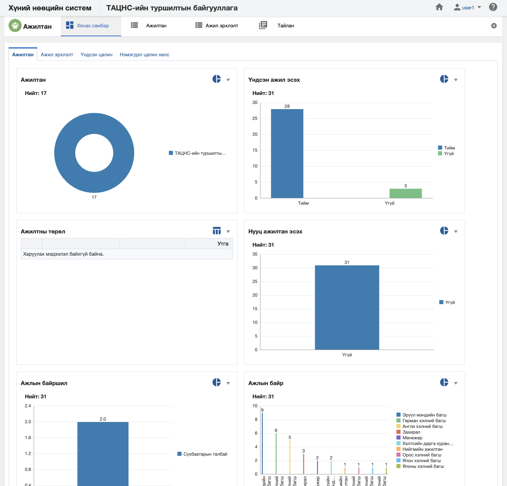

<h1 align="center">Ажилтан модулийн хянах самбар</h1>

**Ажилтан модулийн хянах самбар** нь тухайн байгууллагын ажилтан, ажил эрхлэлт, үндсэн цалин болон нэмэгдэл цалин хөлсний бодит цаг хугацааны мэдээлэл дээр хяналт, шинжилгээ хийх боломжийг олгоно.

> Хянах самбартай ажиллах талаар ерөнхий ойлголтыг [хянах самбартай ажиллах](how-it-works?id=_4-Хянах-самбартай-ажиллах) хэсгээс харна уу.

 

**Ажилтан модулийн хянах самбар нь дараах таб анализуудаас бүрдэнэ.** 

|Хянах самбарын таб|Тайлбар|
|:-----|:------|
|**Ажилтан**|Ажилтны мэдээллээр анализ хийх|
|**Ажил эрхлэлт**|Ажилтны мэдээлэл болон ажил эрхлэлтийн мэдээллээр кросс анализ хийх|
|**Үндсэн цалин**|Ажилтны мэдээлэл болон үндсэн цалингийн мэдээллээр кросс анализ хийх|
|**Нэмэгдэл цалин хөлс**|Ажилтны мэдээлэл болон нэмэгдэл цалин хөлсний мэдээллээр кросс анализ хийх|