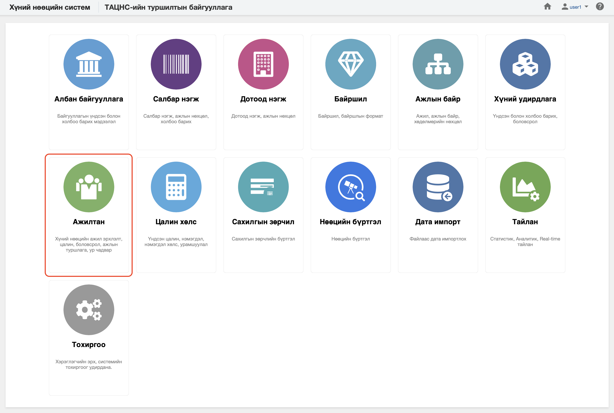

<h1 align="center">Ажилтан модуль</h1>

Байгууллагад ажилд орсноос эхлэн ажлын харилцаа дуусгавар болох хүртлэх үйл явцыг төрийн албаны хүний нөөцийн нэгдсэн системд  **ажилтан** модуль зохион байгуулж удирдана.Энэхүү модульд ажилтны хувийн профайлийн мэдээлэл, ажил эрхлэлт, шилжилт хөдөлгөөн, цалин, нэмэгдэл хөлс гэх мэт ажилтан, ажил эрхлэлттэй холбоотой мэдээллийг үүсгэх, өөрчлөх боломжийг олгоно.
 

Төрийн албаны хүний нөөцийн нэгдсэн системийн ажилтан модуль нь дараах хэсгээс бүрдэнэ.

Үүнд:

- [Хянах самбар](workers/dashboard.md)
- [Ажилтны жагсаалт](workers/worker_list.md)
- [Ажил эрхлэлтийн жагсаалт](workers/worker_employment_list.md)
- [Тайлан](workers/report.md)
- [Үйлдэл](workers/action.md)
