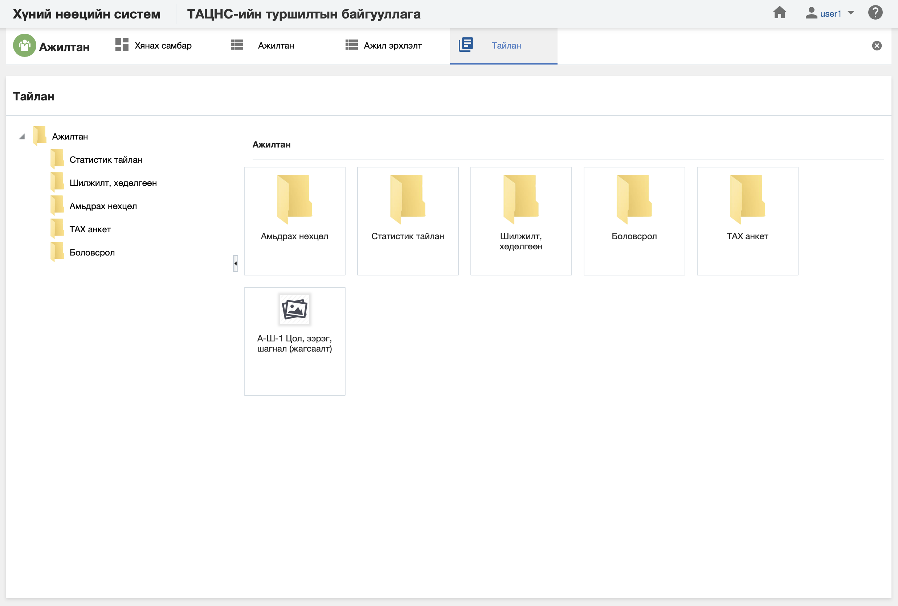

<h1 align="center">Ажилтан модулийн тайлан</h1>

Албан байгууллагын ажилтан дэх мэдээлэлд шинжилгээ хийж дата шинжилгээний үр дүнг урьдчилан бэлтгэсэн тайлангуудын загвараар гаргана.

> Тайлантай хэрхэн ажиллах талаар ерөнхий ойлголтыг [тайлантай ажиллах](how-it-works?id=_5-Тайлантай-ажиллах) хэсгээс харна уу.

Ажилтны мэдээлэл дээр дараах тайлангуудыг урьдчилан тодорхойлсон байна.

**Үүнд:**

- **А-ТАХ-1 ТАХ-ын нэгдсэн тоо (Байгууллагаар)**
   Байгууллагын ажилтны тоог тайлангийн үзүүлэлтээр гаргах тайлан (ТАХ-ын нэгдсэн тоо байгууллагаар)  
- **А-ТАХ-2 ТАХ-ын тоо (Албан тушаалын ангилал, байгууллагаар)**
   Байгууллагын ажилтны тоог тайлангийн үзүүлэлтээр гаргах тайлан (ТАХ-ын тоо албан тушаалын ангилал, байгууллагаар)  
- **А-ТАХ-3 ТАХ-ын тоо (Албан тушаалын зэрэглэл, байгууллагаар)**
   Байгууллагын ажилтны тоог тайлангийн үзүүлэлтээр гаргах тайлан (ТАХ-ын тоо албан тушаалын зэрэглэл, байгууллагаар)  
- **А-ШХ-1 Шилжилт хөдөлгөөн**
   Байгууллагын ажилтны тоог тайлангийн үзүүлэлтээр гаргах тайлан (ТАХ-ын шилжилт хөдөлгөөн)  
- **А-ШХ-2 Халагдсан албан хаагч шалтгаанаар (байгууллагаар)**
   Байгууллагын ажилтны тоог тайлангийн үзүүлэлтээр гаргах тайлан (байгууллагаар)  
- **А-ШХ-3 Чөлөөлөгдсөн алба хаагч шалтгаанаар (засаг захиргааны нэгжээр, байгууллагаар)**
   Байгууллагын ажилтны тоог тайлангийн үзүүлэлтээр гаргах тайлан (Чөлөөлөгдсөн албан хаагч шалтгаанаар-засаг захиргааны нэгжээр, байгууллагаар)  
- **А-ШХ-4 Чөлөөлөгдсөн албан хаагч шалтгаанаар (байгууллагаар нэгтгэл)**
   Байгууллагын ажилтны тоог тайлангийн үзүүлэлтээр гаргах тайлан (Чөлөөлөгдсөн албан хаагч шалтгаанаар-байгууллагаар нэгтгэл)  
- **А-ШХ-4 Чөлөөлөгдсөн албан хаагч шалтгаанаар (байгууллагаар)**
   Байгууллагын ажилтны тоог тайлангийн үзүүлэлтээр гаргах тайлан (Чөлөөлөгдсөн албан хаагч шалтгаанаар-байгууллагаар)  
- **А-АО-1 Амьдрах нөхцөл (жагсаалт)**
   Байгууллагын ажилтны тоог тайлангийн үзүүлэлтээр гаргах тайлан (Амьдрах нөхцөл-жагсаалтаар)  
- **А-АО-1 Амьдрах нөхцөл (нэгтгэл)**
   Байгууллагын ажилтны тоог тайлангийн үзүүлэлтээр гаргах тайлан (Амьдрах нөхцөл-нэгтгэл)  
- **А-АО-2 Амьдрах нөхцөл (нэгтгэл-насаар)**
   Байгууллагын ажилтны тоог тайлангийн үзүүлэлтээр гаргах тайлан (Нэгтгэл-насаар)  
- **А-МБ-1 Боловсрол (жагсаалт)**
   Байгууллагын ажилтны тоог тайлангийн үзүүлэлтээр гаргах тайлан (Боловсрол-жагсаалт)  
- **А-МБ-1 Боловсрол (нэгтгэл)**
   Байгууллагын ажилтны тоог тайлангийн үзүүлэлтээр гаргах тайлан (Боловсрол-нэгтгэл)  