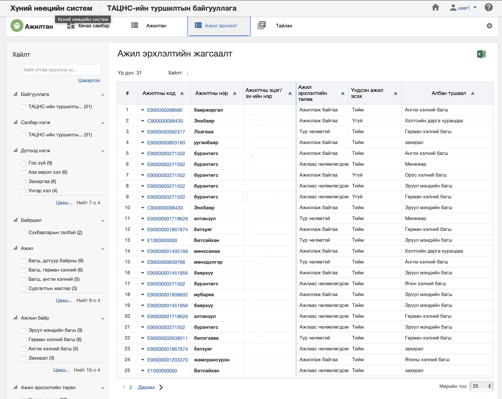
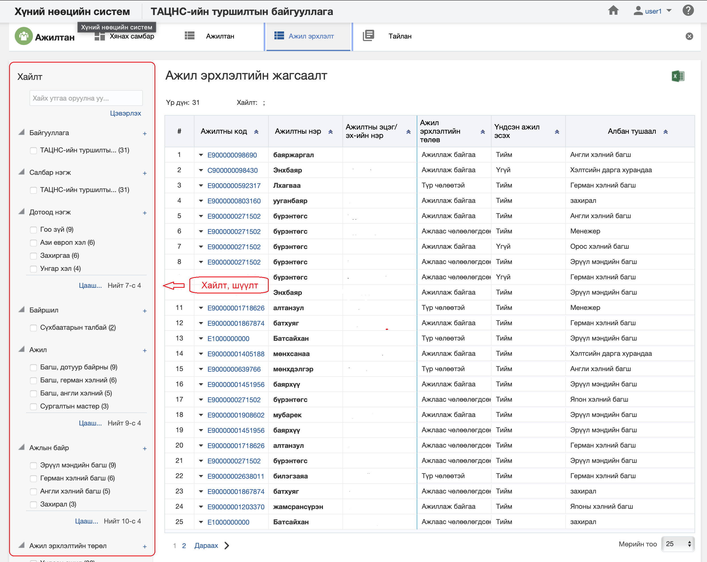
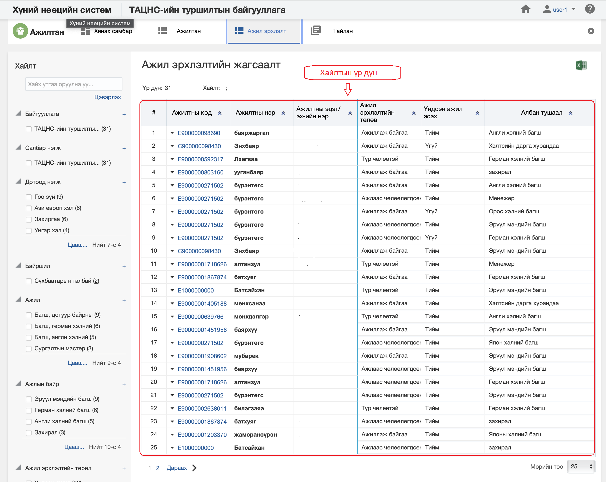

<h1 align="center">Ажил эрхлэлтийн  жагсаалт, хайлт</h1>

Тухайн байгууллагад бүртгэсэн нийт ажил эрхлэлтийн жагсаалтыг энэ хэсэгт харуулах ба хэрэглэгчийн эрх, үүргийн дагуу үйлдэл хийх боломжийг олгоно.

> Жагсаалт, хайлттай ажиллах талаар ерөнхий ойлголтыг [жагсаалт, хайлттай ажиллах](how-it-works?id=_3-Жагсаалт-хайлттай-ажиллах) хэсгээс харна уу.

Ажил эрхлэлтийн жагсаалтын энэ хэсэгт үйлдлүүдийг хийнэ.

### Нарийвчилсан хайлт

Ажил эрхлэлтийн дараах төрлүүдээр нарийвчилан хайх боломжтой.

> Дээрх зурганд ажил эрхлэлтийн хайлт, шүүлтийн хэсгийг харуулж байна.

#### Нарийвчилсан хайлтын төрөл:

- **Байгууллага**
     Байгууллага. Ажил эрхлэлтийн байгууллага 
- **Салбар нэгж**
     Салбар нэгж. Ажил эрхлэлтийн харьяалах салбар нэгж 
- **Дотоод нэгж**
     Дотоод нэгж. Ажил эрхлэлтийн харьяалах дотоод нэгж 
- **Байршил**
     Байршил. Ажил эрхлэлтийн байршлын мэдээлэл
- **Ажилтан**
     Ажилтан. Ажил эрхлэлтийн ажлын байр
- **Ажил**
     Ажил. Ажил эрхлэлтийн ажлын нэр /ҮАМАТ-с/
- **Ажлын байр**
     Ажлын байр. Ажил эрхлэлтийн ажлын байр
- **Ажил эрхлэлтийн төрөл**
     Ажил эрхлэлтийн төрөл. Ажил эрхлэлтийн ажил эрхлэлтийн төрөл. /Үндсэн/гэрээт/
- **Ажил эрхлэлтийн төлөв**
     Ажил эрхлэлтийн төлөв. Ажил эрхлэлтийн ажил эрхлэлт нь ажиллаж байгаа, түр чөлөөтэй..... гэсэн төлөвтэй.
- **Удирдах ажилтан эсэх**
     Удирдах ажилтан эсэх. Удирдах ажилтан эсэх
- **Байнгын ажил/ Түр ажил**
     Байнгын ажил/ Түр ажил. Ажилтан нь байнгын үү? Түр эсэхийн мэдээлэл
- **Бүтэн цагийн ажил/ Цагийн ажил**
     Бүтэн цагийн ажил/ Цагийн ажил. Бүтэн цагийн ажил/ Цагийн ажил эсэхийг ялгана.
- **Ажилтны түвшин**
     Ажилтны түвшин. Удирдах, гүйцэтгэх, туслах ажилтан гэсэн төрлүүдтэй
- **Ажлын байрны ангилал**
     Ажлын байрны ангилал. Ажил эрхлэлтийн ажлын байрны ангилал мэдээлэл
- **Ажлын байрны төрөл**
     Ажлын байрны төрөл. Ажил эрхлэлтийн ажлын байрны төрөл
- **Ажлын байрны дэд төрөл**
     Ажлын байрны дэд төрөл. Ажил эрхлэлтийн ажлын байрны дэд төрөл
- **Цалингийн схем**
     Цалингийн схем. Ажил эрхлэлтийн цалингийн схем
- **Цалингийн зэрэглэл**
     Цалингийн зэрэглэл. Ажил эрхлэлтийн цалингийн зэрэглэл
- **Цалингийн шатлал**
     Цалингийн шатлал. Ажил эрхлэлтийн цалингийн шатлал
- **Цалинтай эсэх**
     Цалинтай эсэх. Ажил эрхлэлтийн цалинтай эсэх
- **Цалингийн төрөл**
     Цалингийн төрөл. Ажил эрхлэлтийн цалингийн төрөл
- **Цалингийн үнэлгээ**
     Цалингийн үнэлгээ. Цалингийн үнэлгээ
- **Цалингийн суурь**
     Цалингийн суурь. Цалингийн суурь
- **Цалингийн мөнгөн тэмдэгт**
     Цалингийн мөнгөн тэмдэгт. Цалингийн мөнгөн тэмдэгт
- **Цалингийн төлөв**
     Цалингийн төлөв. Цалингийн төлөв нь идэвхтэй, идэвхгүй... гэх мэт төлөвтэй байна
- **Цалин бодолтын төлөв**
     Цалин бодолтын төлөв. Цалин бодолтын төлөв нь цалин бодогдоно, цалин бодогдохгүй төлөвтэй байна
- **Ажилтны иргэншил**
     Ажилтны иргэншил. Ажилтны иргэншлын мэдээлэл
- **Ажлын хуваарь**
     Ажлын хуваарь. Ажил эрхлэлтийн ажлын хуваарийн мэдээлэл
- **Туршилтын хугацаатай эсэх**
     Туршилтын хугацаатай эсэх. Ажилтан нь туршилтын хугацаатай эсэх
- **ҮЭ-ийн гишүүн эсэх**
     ҮЭ-ийн гишүүн эсэх. Ажилтан ҮЭ-ийн гишүүн эсэх
- **ХХОАТ төлөх эсэх**
     ХХОАТ төлөх эсэх. Ажилтан ХХОАТ төлөх эсэх
- **Даатгуулагчийн төрөл**
     Даатгуулагчийн төрөл. Даатгуулагчийн мэдээлэл 

### Жагсаалтын мэдээлэл

Ажил эрхлэлтийн хайлтын үр дүнг жагсаалт хэлбэрээр харуулна.

> Дээрх зурганд ажил эрхлэлтийн жагсаалтын үр дүнг харуулж байна.

#### Хайлтын үр дүнгийн мэдээлэл:

- **Ажилтны код**
     Ажилтны код. Ажилтны давхцахгүй код   
- **Ажилтны нэр**
     Ажилтны нэр. Ажилтны нэр  
- **Ажилтны эцэг /эх/-ийн нэр**
     Ажилтны эцэг /эх/-ийн нэр. Ажилтны эцэг /эх/-ийн нэр  
- **Ажил эрхлэлтийн төлөв**
     Ажил эрхлэлтийн төлөв. Ажил эрхлэлтийн  ажиллаж байгаа, түр чөлөөтэй, ажлаас чөлөөлөгдсөн гэх мэт төлөвтэй байна.  
- **Үндсэн ажил эсэх**
     Үндсэн ажил эсэх. Үндсэн ажил эсэх  
- **Албан тушаал**
     Албан тушаал. Албан тушаал  
- **Ажил эрхлэлтийн төрөл**
     Ажил эрхлэлтийн төрөл. Ажил эрхлэлтийн төрөл. /Үндсэн/гэрээт/
- **Ажил эрхлэлтийн төлөв**
     Ажил эрхлэлтийн төлөв. Ажил эрхлэлт нь ажиллаж байгаа, түр чөлөөтэй..... гэсэн төлөвтэй.
 **Ажил эрхлэлт эхлэх огноо**
     Ажил эрхлэлт эхлэх огноо. Ажил эрхлэлт эхлэх огноо 
- **Ажлын байр**
     Ажлын байр. Ажлын байр
 **Байршил**
     Байршил. Ажил эрхлэлтийн байршил
**Байгууллага**
     Байгууллага. Ажил эрхлэлтийн байгууллага 
- **Салбар нэгж**
     Салбар нэгж. Ажил эрхлэлтийн харьяалах салбар нэгж 
- **Дотоод нэгж**
     Дотоод нэгж. Ажил эрхлэлтийн харьяалах дотоод нэгж 
- **Удирдах ажилтан эсэх**
     Удирдах ажилтан эсэх. Ажилтан удирдах ажилтан эсэх
- **Байнгын ажил/ Түр ажил**
     Байнгын ажил/ Түр ажил. Ажилтан нь байнгын үү? Түр эсэхийн мэдээлэл
- **Бүтэн цагийн ажил/ Цагийн ажил**
     Бүтэн цагийн ажил/ Цагийн ажил. Бүтэн цагийн ажил/ Цагийн ажил эсэхийг ялгана.
- **Ажлын байрны ангилал**
     Ажлын байрны ангилал. Ажил эрхлэлтийн ажлын байрны ангилал мэдээлэл
- **Ажлын байрны төрөл**
     Ажлын байрны төрөл. Ажил эрхлэлтийн ажлын байрны төрөл
- **Ажлын байрны дэд төрөл**
     Ажлын байрны дэд төрөл. Ажил эрхлэлтийн ажлын байрны дэд төрөл
- **Цалингийн схем**
     Цалингийн схем. Ажил эрхлэлтийн цалингийн схем
- **Цалингийн зэрэглэл**
     Цалингийн зэрэглэл. Ажил эрхлэлтийн цалингийн зэрэглэл
- **Цалингийн шатлал**
     Цалингийн шатлал. Ажил эрхлэлтийн цалингийн шатлал
- **Цалинтай эсэх**
     Цалинтай эсэх. Ажил эрхлэлтийн цалинтай эсэх
- **Цалингийн төрөл**
     Цалингийн төрөл. Ажил эрхлэлтийн цалингийн төрөл
- **Цалингийн үнэлгээ**
     Цалингийн үнэлгээ. Цалингийн үнэлгээ
- **Цалингийн дүн**
     Цалингийн дүн. Ажил эрхлэлтийн цалингийн дүн
- **Ажил**
     Ажил. Ажил эрхлэлтийн ажлын нэр /ҮАМАТ-с/
- **Цалингийн суурь**
     Цалингийн суурь. Цалингийн суурь
- **Цалингийн мөнгөн тэмдэгт**
     Цалингийн мөнгөн тэмдэгт. Цалингийн мөнгөн тэмдэгт
- **Цалингийн төлөв**
     Цалингийн төлөв. Цалингийн төлөв нь идэвхтэй, идэвхгүй... гэх мэт төлөвтэй байна
- **Цалин бодолтын төлөв**
     Цалин бодолтын төлөв. Цалин бодолтын төлөв нь цалин бодогдоно, цалин бодогдохгүй төлөвтэй байна
- **Удирдах ажил эрхлэлтийн нэр**
     Удирдах ажил эрхлэлтийн нэр. Удирдах ажил эрхлэлтийн нэр
- **Удирдах ажил эрхлэлтийн эцэг /эх/-ийн нэр**
     Удирдах ажил эрхлэлтийн эцэг /эх/-ийн нэр. Удирдах ажил эрхлэлтийн эцэг /эх/-ийн нэр
- **Удирдах ажил эрхлэлтийн албан тушаал**
     Удирдах ажил эрхлэлтийн албан тушаал. Ажил эрхлэлтийн удирдах ажил эрхлэлтийн албан тушаал
- **Ажлын хуваарь**
     Ажлын хуваарь. Ажил эрхлэлтийн ажлын хуваарь
- **Туршилтын хугацаатай эсэх**
     Туршилтын хугацаатай эсэх. Ажил эрхлэлтийн ажлын байр туршилтын хугацаатай эсэх
- **Туршилтын хугацаа эхлэх огноо**
     Туршилтын хугацаа эхлэх огноо. Туршилтын хугацаатай ажлын байр бол туршилтын хугацаа эхлэх огноо 
- **Туршилтын хугацаа дуусах огноо**
     Туршилтын хугацаа дуусах огноо. Туршилтын хугацаатай ажлын байр бол туршилтын хугацаа дуусах огноо 
- **Туршилтын хугацаанд цалинжих хувь**
     Туршилтын хугацаанд цалинжих хувь. Туршилтын хугацаатай ажлын байр бол туршилтын хугацаанд цалинжих хувь
- **ҮЭ-ийн гишүүн эсэх**
     ҮЭ-ийн гишүүн эсэх. Ажилтан ҮЭ-ийн гишүүн эсэх
- **ХХОАТ төлөх эсэх**
     ХХОАТ төлөх эсэх. Ажилтан ХХОАТ төлөх эсэх
- **Даатгуулагчийн төрөл**
     Даатгуулагчийн төрөл. Даатгуулагчийн мэдээлэл 
- **Даатгуулагчийн төрөл эхлэх огноо**
     Даатгуулагчийн төрөл эхлэх огноо. Даатгуулагчийн төрөл эхлэсэн огноо
- **Даатгуулагчийн төрөл дуусах огноо**
     Даатгуулагчийн төрөл дуусах огноо. Даатгуулагчийн төрөл дууссан огноо
